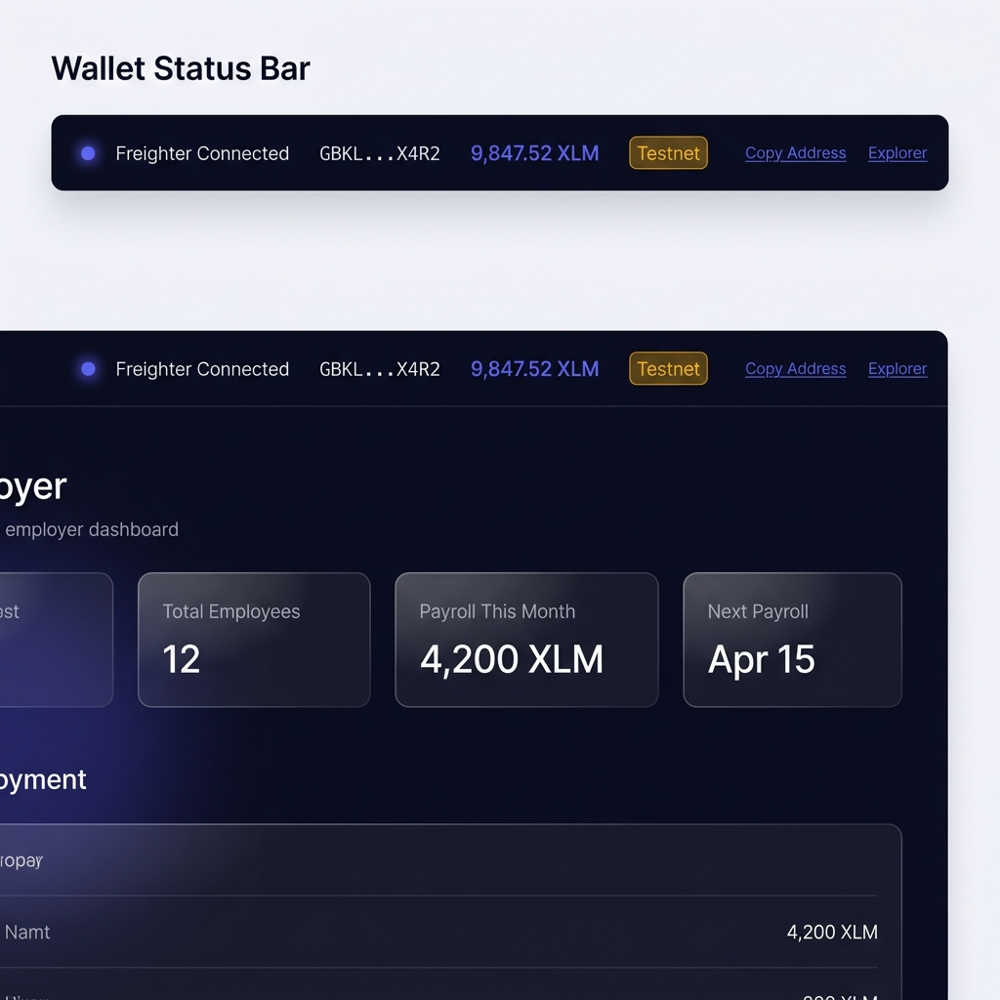
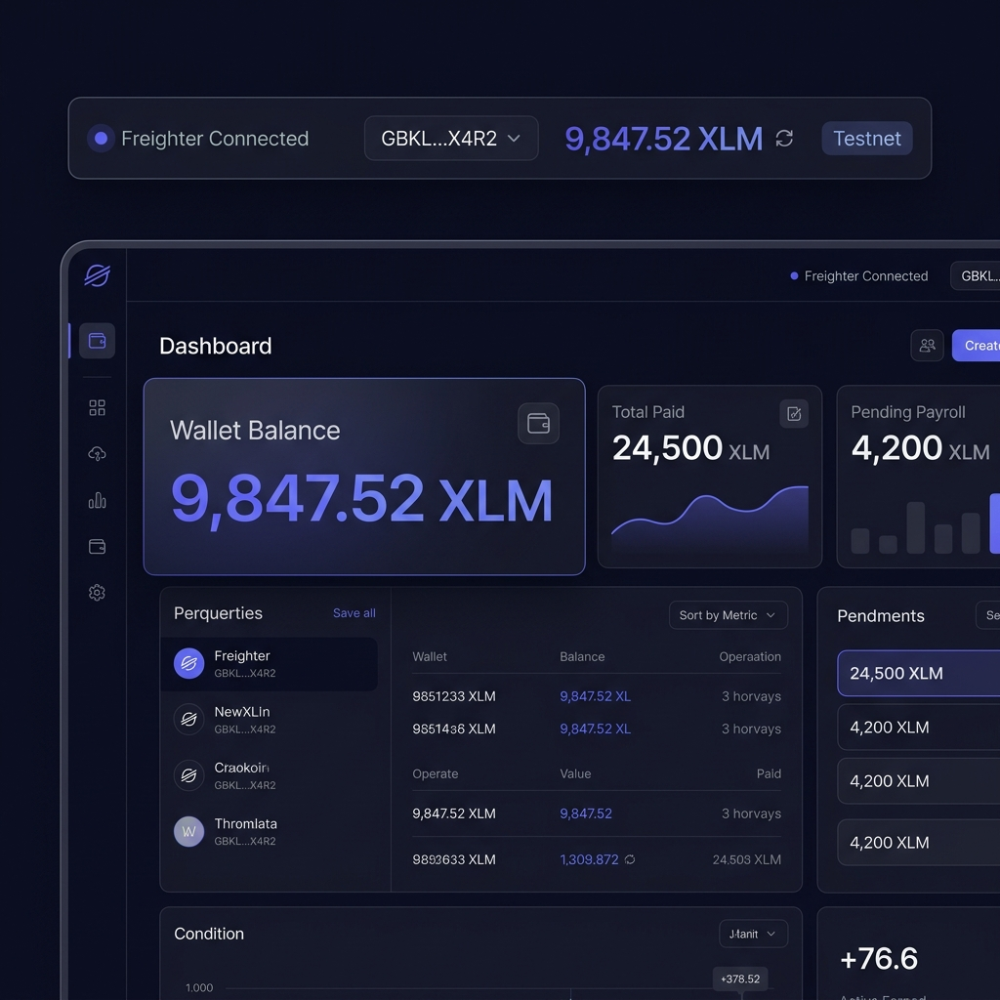
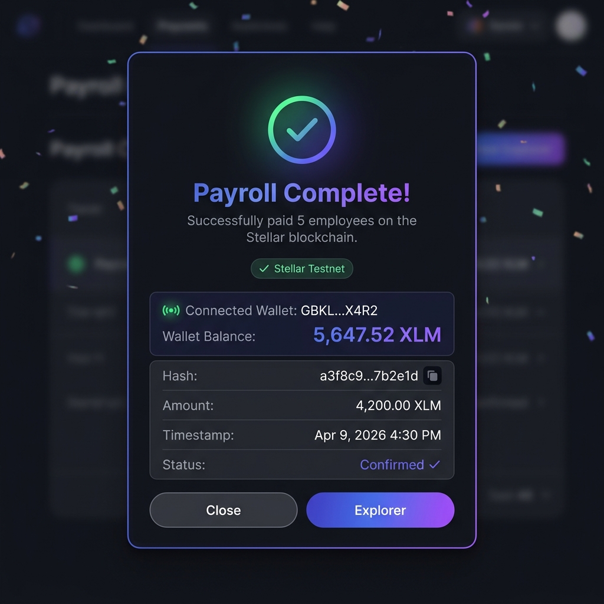
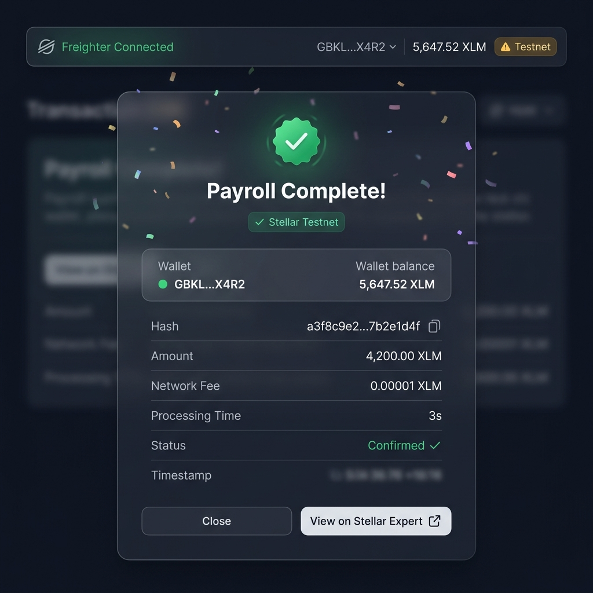

# PaySlip — On-chain XLM payroll

## Project Description
PaySlip is a decentralized payroll management system that enables employers to pay their global workforce instantly using XLM on the Stellar network. By moving payroll on-chain, we eliminate banking delays, reduce cross-border fees, and provide immutable proof of payment for both employers and employees. The app handles employee onboarding, automated salary calculations, and bulk transaction processing.

## Setup Instructions (How to run locally)

### Prerequisites
- Node.js 18+
- MongoDB Atlas account
- Freighter wallet extension

### Steps
1. **Clone the repository**
   ```bash
   git clone https://github.com/parth1241/payslip.git
   cd payslip
   ```

2. **Install dependencies**
   ```bash
   npm install
   ```

3. **Configure Environment Variables**
   Create a `.env.local` file and add your MongoDB and NextAuth configuration.

4. **Run Development Server**
   ```bash
   npm run dev
   ```

5. **Access the App**
   Open [http://localhost:3000](http://localhost:3000) in your browser.

## Screenshots

### Wallet Connected State


### Balance Displayed


### Successful Testnet Transaction


### Transaction Result Shown to the User


